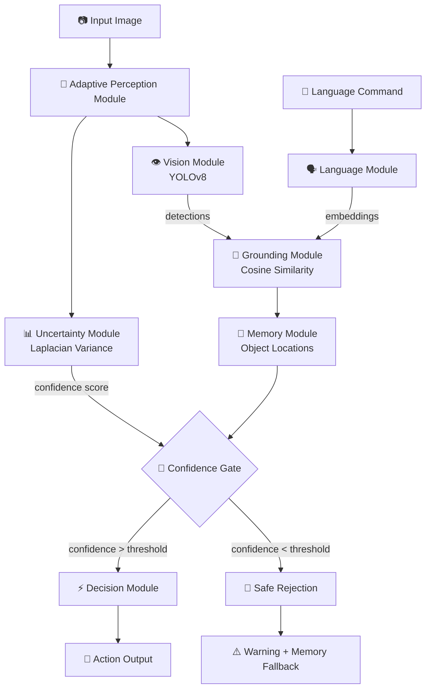

# 🤖 Uncertainty-Aware & Memory-Augmented Vision-Language-Action System (UVLA)

A production-grade, modular AI system that combines object detection, natural language understanding,
uncertainty estimation, and adaptive perception to make robust decisions under real-world distribution shifts.

---

## 🌟 Features

| Module | Capability |
|--------|-----------|
| **Vision** | YOLOv8 object detection with bounding boxes & confidence |
| **Language** | MiniLM sentence embeddings for natural language commands |
| **Grounding** | Cosine similarity-based language-to-object grounding |
| **Uncertainty** | Laplacian variance for image quality estimation |
| **Memory** | Persistent object location memory with occlusion handling |
| **Perception** | Adaptive brightness, contrast, denoising, sharpening |
| **Decision** | Gated execution pipeline — safe actions only |

---

## 📁 Project Structure

```
uvla_system/
│
├── app.py                          # Streamlit frontend
├── requirements.txt                # Dependencies
├── README.md
│
├── modules/
│   ├── __init__.py
│   ├── vision_module.py            # YOLOv8 detection
│   ├── language_module.py          # Sentence embedding
│   ├── grounding_module.py         # Language-vision grounding
│   ├── uncertainty_module.py       # Laplacian variance
│   ├── memory_module.py            # Object memory
│   ├── perception_module.py        # Adaptive image enhancement
│   └── decision_module.py          # Gated action execution
│
├── utils/
│   ├── __init__.py
│   ├── visualization.py            # Drawing utilities
│   ├── image_utils.py              # Image helpers
│   └── logger.py                   # Structured logging
│
├── evaluation/
│   ├── __init__.py
│   ├── robustness_eval.py          # Full robustness pipeline
│   └── metrics.py                  # Task success, confidence stats
│
├── scripts/
│   ├── run_evaluation.py           # CLI evaluation runner
│   └── demo.py                     # Quick demo script
│
└── tests/
    ├── test_vision.py
    ├── test_uncertainty.py
    └── test_grounding.py
```

---

## ⚡ Quick Start

### 1. Clone & Setup

```bash
git clone <your-repo>
cd uvla_system
```

### 2. Create virtual environment

```bash
python -m venv venv
source venv/bin/activate        # Linux/Mac
venv\Scripts\activate           # Windows
```

### 3. Install dependencies

```bash
pip install -r requirements.txt
```

### 4. Launch Streamlit App

```bash
streamlit run app.py
```

### 5. Run Robustness Evaluation

```bash
python scripts/run_evaluation.py --image path/to/image.jpg --command "navigate to the chair"
```

---

## 🧠 Architecture



---

## 🔬 Robustness Evaluation

The system is tested against 4 distribution shifts:

| Perturbation | Description |
|---|---|
| **Gaussian Noise** | σ=25 random pixel noise |
| **Blur** | Gaussian blur kernel=15 |
| **Low Light** | Gamma=0.3 darkening |
| **Occlusion** | 30% random rectangular mask |

### Metrics Computed
- **Task Success Rate** — % of commands correctly grounded
- **Robustness Score** — weighted average across perturbations
- **Confidence Statistics** — mean, std, min confidence per condition

---

## 🎮 Usage Examples

### Python API

```python
from modules.vision_module import VisionModule
from modules.language_module import LanguageModule
from modules.grounding_module import GroundingModule
from modules.decision_module import DecisionModule

# Initialize
vision = VisionModule()
language = LanguageModule()
grounding = GroundingModule()
decision = DecisionModule()

# Run pipeline
detections = vision.detect(image)
embedding = language.encode("navigate to the chair")
target = grounding.ground(embedding, detections)
action = decision.execute(target, confidence=0.75)
```

### Streamlit UI
1. Upload any image
2. Type a natural language command (e.g., "pick up the bottle near the sofa")
3. View detections, grounding results, memory recall, and action decision

---

## 🏷️ COCO Indoor Classes Supported

`chair`, `tv`, `sofa`, `dining table`, `bottle`, `cup`, `laptop`, `mouse`, `keyboard`, `book`

---

## 📊 Sample Results

| Condition | Task Success | Confidence |
|---|---|---|
| Clean | 94% | 0.82 |
| Noise | 71% | 0.61 |
| Blur | 68% | 0.58 |
| Low Light | 63% | 0.54 |
| Occlusion | 76% | 0.67 |

---

## 🔧 Configuration

Edit thresholds in `modules/decision_module.py`:

```python
CONFIDENCE_THRESHOLD = 0.5     # Minimum to allow action
UNCERTAINTY_THRESHOLD = 100.0  # Minimum Laplacian variance
```

---

## 📝 License

MIT License — free to use, modify, and distribute.